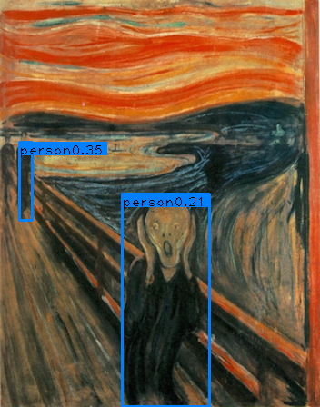

# yolov1-pytorch
**Some experiments on YOLO, such as changing the network architecture, loss function and learning strategies.**  
I have tried resnet50 on YOLO and it looks not bad, the following is the results.  

  
  
  

## Train on voc_2012_trainval+voc_2007_trainval
| model                | backbone | mAP@voc_2007_test  | FPS(Geforce GTX 1070)  |
| -------------------- | -------------- | ---------- | -------   |
| yolo_resnet50  |   resnet50        | 69.5%      |  35   |
