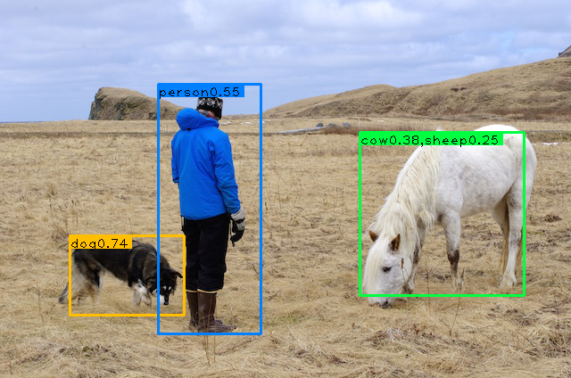

## yolov1-pytorch
基于YOLOv1的pytorch实现，但使用了不同的主干网络，没有全连接层，损失函数的计算上也有所差异，不过取得了比较不错的结果:

| model(Train on voc2012+2007)|  backbone          | map@voc2007test | FPS(Geforce GTX 1070)  |
| --------------------        |  ------------      | ----------      | -------   |
| YOLO_ResNet50_7x7           |  ResNet50          | 66.8%           |  46   |
| YOLO_ResNet50_14x14         |  ResNet50 + [DetNet](https://arxiv.org/abs/1804.06215) | 69.5%           |  35   |
| YOLO_VGG16_7x7              |  VGG16_bn             | 61.8%           |  53   |

## 依赖包（python3）
- pytorch-1.0
- opencv
- tqdm
- visdom（可选）

## 下载:  
  ```
  git clone https://https://github.com/Eversee22/yolov1-pytorch.git  
  cd yolov1-pytorch  
  git checkout exp1-loss
  ```

## 检测  

  * 图片

    `python detect.py -i data/person.jpg weights.pth`

    以上的代码将检测单张图片，其中 `weights.pth` 需更换为实际的权重路径，以上执行的结果如下：  

    

    还可以对某个目录中的所有图片（png 或 jpg）全部检测：  

    `python detect.py -i data -t test2 weights.pth `

    或者输入列有图片路径的文件：  

    `python detect.py -i 2007_test.txt -t test2 weights.pth`

  * 视频

    `python video.py -i yourvideofile weights.pth`

    以上命令对视频检测，会显示实时的视频检测结果，取决于具体的硬件，检测帧率可能会有差异，若想以原视频的帧率保存检测后的视频，使用以下命令：  

    `python video.py -i yourvideofile --dv 1 weights.pth`

    将以avi格式保存视频，默认在local目录中。

  **注意: 默认采用 ResNet50_14x14 的模型，若使用 7x7 的模型，需要更改 `cfg` 目录下的 `yolond` 文件，将 `side` 改为 7，`downsm` 改为 1.**

## 训练  
  下载 VOC 2007 和 VOC 2012 数据集，可参考如下链接：  
  ```
  https://pjreddie.com/media/files/VOCtrainval_11-May-2012.tar
  https://pjreddie.com/media/files/VOCtrainval_06-Nov-2007.tar
  https://pjreddie.com/media/files/VOCtest_06-Nov-2007.tar
  ```
  解压以上数据，默认均解压到 `VOCdevkit` 目录，使用 `python voc_label_bbox.py` 命令产生训练文件，默认保存在 `data` 目录中，然后将该目录下的   
  `voc_2007_train.txt voc_2007_val.txt voc_2012_train.txt voc_2012_val.txt`
  合并成一个文件，如在 linux 中，可使用命令 `cat voc_2007_train.txt voc_2007_val.txt voc_2012_* > train.txt`

  **注意：取决于 `VOCdevkit` 的位置，可能需要改变 `voc_label_bbox.py` 中的 `VOC_root` 参数， 以明确 `VOCdevkit` 所处的路径，默认在 `data` 目录下**

  准备好数据之后，运行命令 `python train.py` 就可以开始训练了，如果配置没有任何错误，训练过程就会正常进行，默认训练 50 个epoch，在 VOC 2007 数据集上使用单块 GTX 1070 GPU 大约需要 3~4 个小时, 在 VOC 2007+2012 则大致需要3倍的时间（虽然也可以使用CPU训练，但并不推荐，当然时间充足者随意）。如果想可视化训练过程，则需要安装 `visdom` 依赖包，并使用 `python -m visdom.server` 先启用 visdom 服务，然后在使用训练命令时设置一个环境参数，如 `python train.py -env test` 将会开启名为 test的 visdom可视化环境，这时在浏览器中就可以观察到训练时的损失变化曲线了。

  **注意：默认采用 ResNet50 作为主干网络，若换用VGG16, 则需使用 `-n` 的参数明确使用的网络，如 `python train.py -n vgg16`, 在检测时也需要注意这一点，否则权重加载可能会出现错误。另外对于ResNet50, 可以使用 7x7 或 14x14 的输出，这同检测时的配置一致**

## 计算mAP
  使用 `python voc_label_07test.py` 产生测试数据，默认在 `data` 目录，名为 `2007_test.txt`，然后运行以下命令序列：  
  ```
  python detect.py -i data/2007_test.txt -t eval weights.pth
  python reval_voc_py3.py results
  ```
